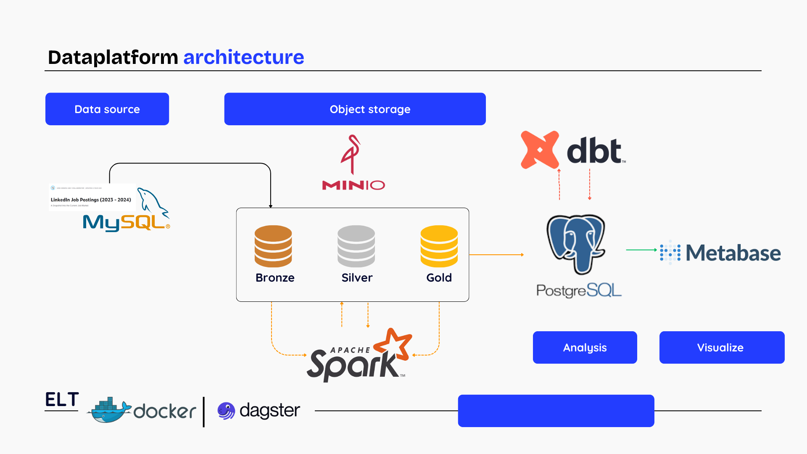
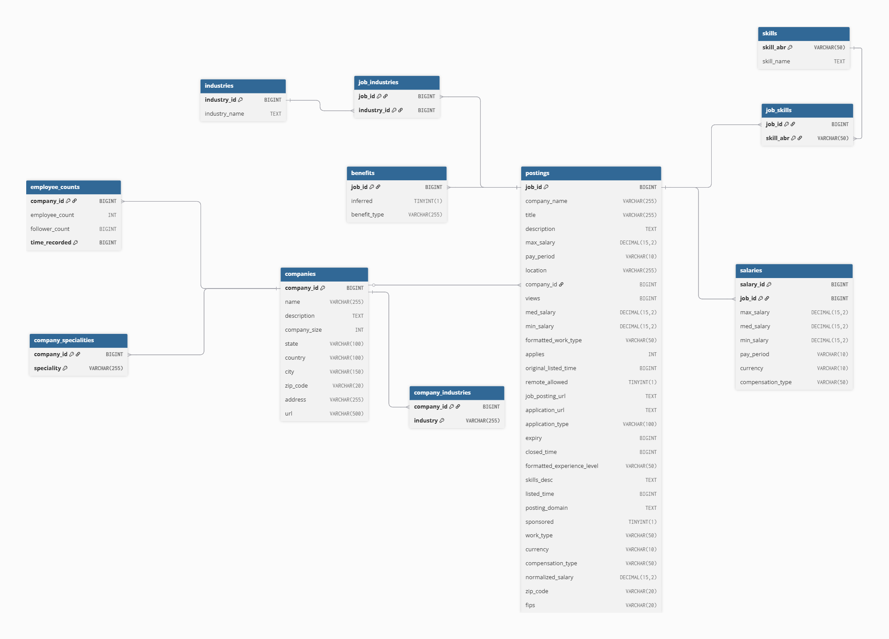

# LinkedIn Jobs Market Data platform

## 1. Overview
Built a data platform analyzing 50,000+ LinkedIn job postings (2023–2024), providing insights into hiring trends and workforce demand
## 2. Features
This project delivers a data platform that supports analytical applications built with Metabase. Large volumes of data can be efficiently processed in partitions and orchestrated using Dagster. The system leverages dbt to perform data transformations and analytics on datasets stored in MinIO. In addition, Apache Spark has been integrated into the platform to enable advanced processing capabilities and future innovations.
## 3. Architecture

**Bronze Layer**

* **Source:** MySQL
* **Storage:** Minio
* **Purpose:** Stores the **raw dataset** downloaded from Kaggle without any modifications.

**Silver Layer**

* **Source:** Bronze Layer
* **Storage:** Minio
* **Processing Frameworks:** Apache Spark, Pandas
* **Purpose:** Contains **cleaned and standardized data** loaded from the Bronze Layer. This layer ensures data quality and consistency before moving to higher layers.

**Gold Layer**

* **Source:** Silver Layer
* **Storage:** PostgreSQL
* **Processing Frameworks:** Apache Spark, Pandas
* **Transformation Tool:** dbt
* **Purpose:** Stores **aggregated and modeled data** (fact and dimension tables) transformed from the Silver Layer. This layer is optimized for analytics and reporting.

**Visualization Layer**

* **Tool:** Metabase
* **Purpose:** Provides **interactive analytics and visualizations** based on the curated data in the Gold Layer.


### 3.1. Workflow

### 3.2. Data lineage

### 3.3. Data source schema

#### Summary Dataset
**job_postings.csv**
- job_id: The job ID as defined by LinkedIn (https://www.linkedin.com/jobs/view/job_id )
- company_id: Identifier for the company associated with the job posting (maps to companies.csv)
- title: Job title.
- description: Job description.
- max_salary: Maximum salary
- med_salary: Median salary
- min_salary: Minimum salary
- pay_period: Pay period for salary (Hourly, Monthly, Yearly)
- formatted_work_type: Type of work (Fulltime, Parttime, Contract)
- location: Job location
- applies: Number of applications that have been submitted
- original_listed_time: Original time the job was listed
- remote_allowed: Whether job permits remote work
- views: Number of times the job posting has been viewed
- job_posting_url: URL to the job posting on a platform
- application_url: URL where applications can be submitted
- application_type: Type of application process (offsite, complex/simple onsite)
- expiry: Expiration date or time for the job listing
- closed_time: Time to close job listing
- formatted_experience_level: Job experience level (entry, associate, executive, etc)
- skills_desc: Description detailing required skills for job
- listed_time: Time when the job was listed
- posting_domain: Domain of the website with application
- sponsored: Whether the job listing is sponsored or promoted.
- work_type: Type of work associated with the job
- currency: Currency in which the salary is provided.
- compensation_type: Type of compensation for the job.

**job_details/benefits.csv**
- job_id: The job ID
- type: Type of benefit provided (401K, Medical Insurance, etc)
- inferred: Whether the benefit was explicitly tagged or inferred through text by LinkedIn

**company_details/companies.csv**
- company_id: The company ID as defined by LinkedIn
- name: Company name
- description: Company description
- company_size: Company grouping based on number of employees (0 Smallest - 7 Largest)
- country: Country of company headquarters.
- state: State of company headquarters.
- city: City of company headquarters.
- zip_code: ZIP code of company's headquarters.
- address: Address of company's headquarters
- url: Link to company's LinkedIn page

**company_details/employee_counts.csv**
- company_id: The company ID
- employee_count: Number of employees at company
- follower_count: Number of company followers on LinkedIn
- time_recorded: Unix time of data collection
## 4. How to run
### 4.1 Prerequisites
- Docker
- Docker Compose
- Python 3.12
- DBeaver

### 4.2 Deployment Guide

#### 4.2.1. Create and activate virtual environment

```bash
python -m venv venv
venv/Scripts/activate   # Windows
# or
source venv/bin/activate       # Linux / MacOS
```

#### 4.2.2. Download the source code

```bash
git clone https://github.com/AIDE-FDE/linkedIn_job_datapl4tform.git
cd linkedIn_job_datapl4tform
```

#### 4.2.3. Environment configuration

* Create a `.env` file in the project root folder.
* Use `sample_env.txt` as a reference for formatting.

#### 4.2.4. Build and start services with Docker

```bash
docker-compose build   # or make build
docker-compose up -d   # or make up
```

#### 4.2.5. Prepare the dataset

- Download dataset from Kaggle

```bash
python linkedin_dataset_downloader.py
```

- Load dataset into MySQL
```bash
# Copy data and SQL scripts into the MySQL container:
docker cp data/linkedin_23/ de_mysql:/tmp/
docker cp scripts/raw_mysql_linkedin23_schema.sql de_mysql:/tmp/
docker cp scripts/load_data.sql de_mysql:/tmp/

# Enable local infile in MySQL:
make to_mysql_root
SHOW GLOBAL VARIABLES LIKE 'LOCAL_INFILE';
SET GLOBAL LOCAL_INFILE=TRUE;
exit

# Create tables and load data:
make to_mysql
source /tmp/raw_mysql_linkedin23_schema.sql;
source /tmp/load_data.sql;

# Fix corrupted data (if needed):
docker cp postings_repair.csv de_mysql:/tmp/
docker cp scripts/update_postings.sql de_mysql:/tmp/
make to_mysql
source /tmp/update_postings.sql;
```

#### 4.2.6. Access integrated tools

* **Dagster WebUI (data pipelines):** [http://localhost:3001](http://localhost:3001)
* **DBeaver (database client):**

  * MySQL

    ```
    Host: localhost
    Port: 3306
    Database: linkedin_job
    Username: admin
    Password: admin123
    ```

    *(or based on your `.env` config)*
  * PostgreSQL

    ```
    Host: localhost
    Port: 5433
    Database: postgres
    Username: admin
    Password: admin123
    ```

    *(or based on your `.env` config)*
* **Minio (object storage):** [http://localhost:9001](http://localhost:9001)
* **Metabase (analytics & visualization):** [http://localhost:3000](http://localhost:3000)

#### 4.2.7. View dbt documentation & lineage graph

```bash
cd etl_pipeline/linkedin_job_market
dbt docs generate
dbt docs serve
```

Access it at: [http://localhost:8080](http://localhost:8080)

## 5. Interfaces
- [http://localhost:3001](http://localhost:3001)   -------------     Dagster WebUI
- [http://localhost:8080](http://localhost:8080)   -------------     Dbt docs
- [http://localhost:3000](http://localhost:3000)   -------------     Metabase
- [http://localhost:9001](http://localhost:9001)   -------------     Minio
- [http://localhost:8082](http://localhost:8082)   -------------     Spark Master


